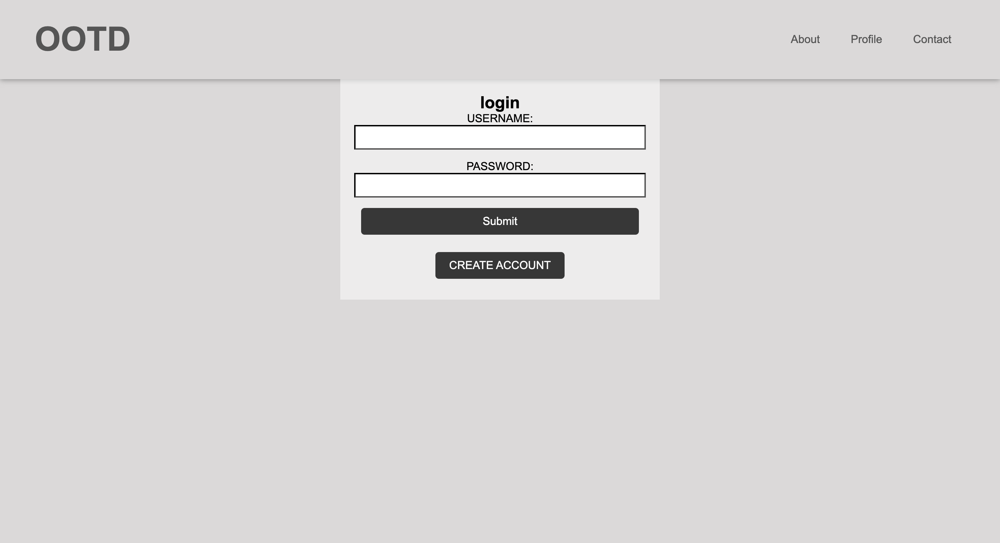
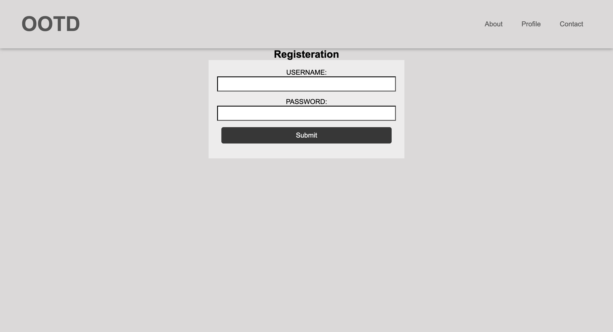
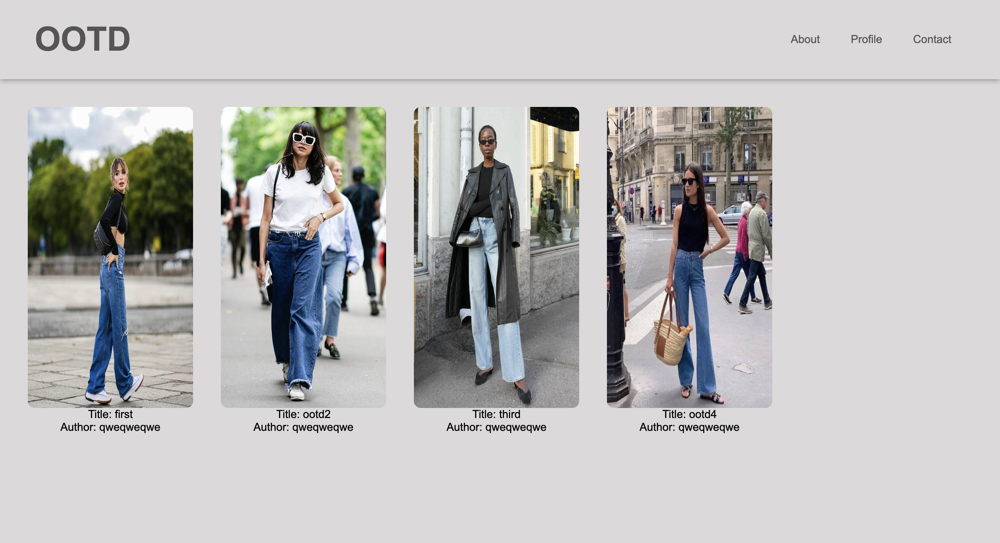
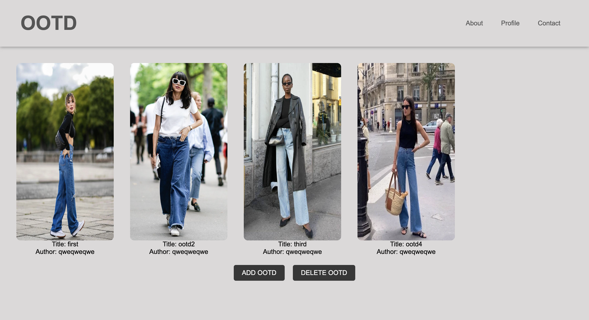
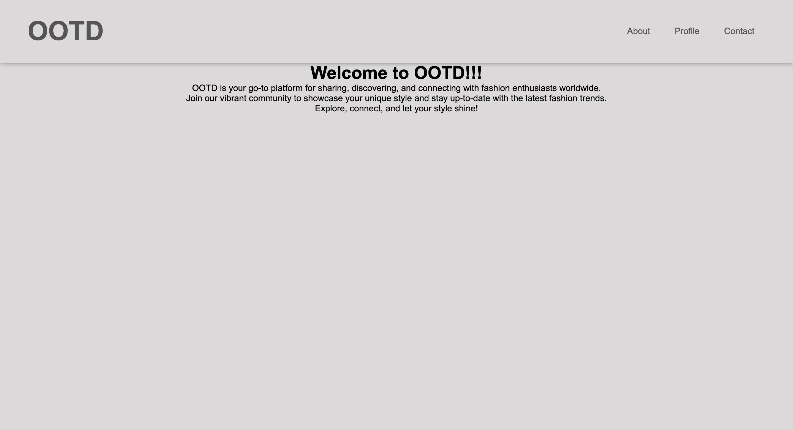
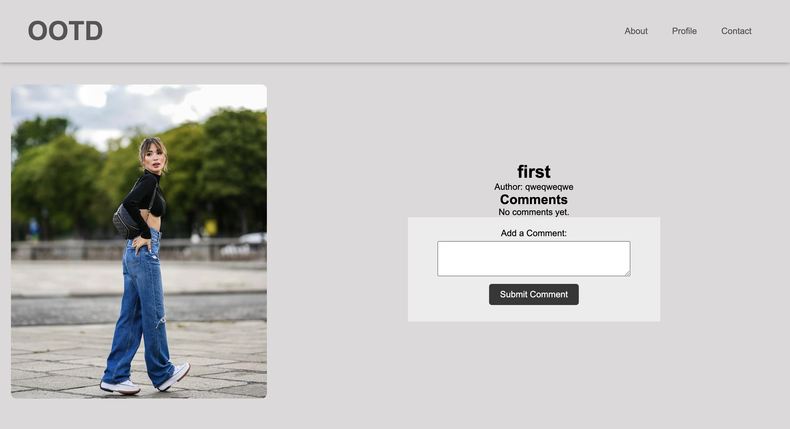
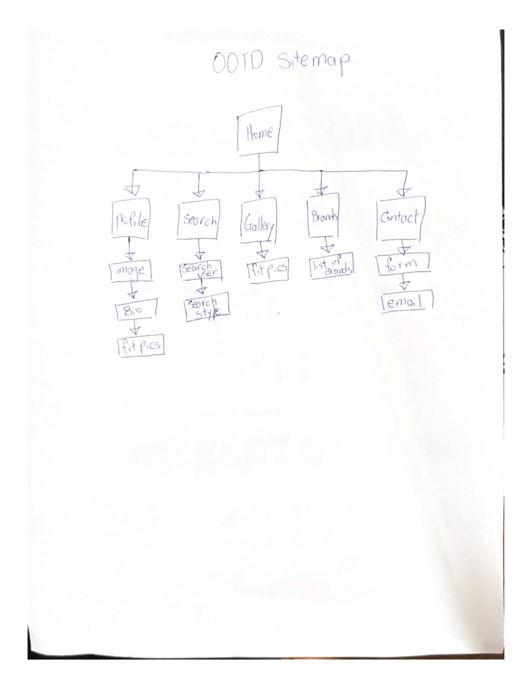
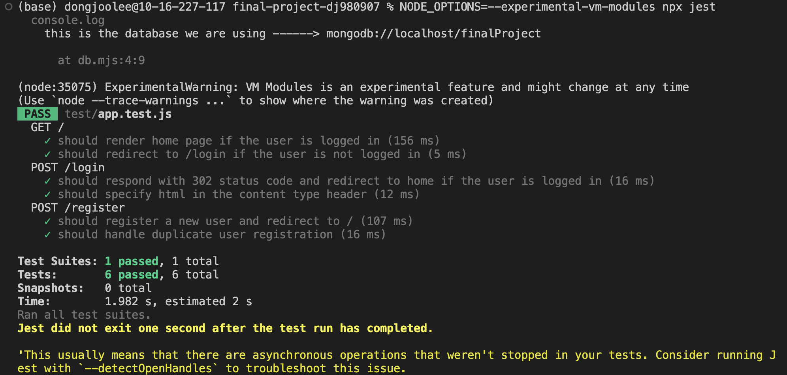

# OOTD Sharing Platform

## Overview

The Outfit Sharing Platform is a web application designed to allow users to share, discover, and interact with each other's OOTDs. Users can create accounts, submit the favorite picture of their outfit, comment on other's OOTDs, follow other users, and explore a vast collection of fashion sense.<br>
The application employs Express as the backend framework and MongoDB as the database, offering a user-friendly interface and various features to enhance the OOTD-sharing experience!


## Data Model

For the OOTD Sharing Platform, the data model will consist of Users, OOTDs, Comments, and Ratings, each with their own set of attributes and relationships.

User Model:
<ul>
  <li>Each user can have multiple recipes and comments.
  <li>Users have basic profile information like username, email, and password (hashed).
  <li>User profiles may also include additional information like a profile picture and bio.
</ul>
An Example User:

```javascript
{
  username: "slaybae123",
  email: "shannon@example.com",
  password: // a password hash,
  profilePicture: // a URL to the profile picture,
  bio: "love street wears",
  OOTD: // an array of references to outfit documents,
  comments: // an array of references to Comment documents,
  followers: // an array of references to other User documents,
  following: // an array of references to other User documents,
  createdAt: // timestamp
}
```

OOTD Model:
<ul>
  <li>Each ootd can have multiple comments and ratings.
  <li>OOTD include details like title, clothes, brands, categories, author, comments, rating, and an image.
</ul>

```javascript
{
  title: "concert outfit",
  clothes: [
    "pants",
    "baseball hat",
    "tshirt",
    "sunglasses",
  ],
  brands: "gucci,louis vuitton, prada",
  categories: ["street", "concert"],
  image: // a URL to the recipe image,
  author: // a reference to the User who created the recipe,
  comments: // an array of references to Comment documents,
  ratings: // an array of Ratings documents,
  createdAt: // timestamp
}

```

Comment Model:
<ul>
  <li>Comments are tied to a specific ootd and a user who left the comment.
  <li>They include the comment content and a timestamp.
</ul>

```javascript
{
  value: 4, // the rating value (e.g., 4 stars)
  ootd: // a reference to the ootd associated with this rating,
  author: // a reference to the User who gave the rating,
  createdAt: // timestamp
}
```

## [Link to Commented First Draft Schema](db.mjs) 

This is a link to my db.mjs that contains my schemas: [db.mjs](db.mjs)


## Wireframes

# Login Page and Registration Page
- Login Page: Login page for existing users to log in
  

- Registration Page: Registration Page for new users
  

# Home Page and Profile Page
- Home Page: Home page of the website
  

- Profile Page: Profile page for the user
  

- About Page: About page for a brief description of the platform
  

# Gallery Page and Fit Detail Page
- Gallery Page: Gallery Page for all the OOTDs
  

- Fit Detail Page: Detail of each OOTD
  

## Site map



## Unit Test


## User Stories

1. As a non-registered user, I can create a new account on the platform to start sharing and discovering outfits.
2. As a registered user, I can log in to my account to access my profile and interact with the community.
3. As a user, I can share a new Outfit of the Day (OOTD) to showcase my fashion sense and inspire others.
4. As a user, I can view all the OOTDs I've shared in a single list on my profile.
5. As a user, I can search for specific outfit categories to discover outfits that match my style preferences.
6. As a user, I can add details about my outfit, including the clothing items, brands, and a brief description when posting an OOTD.
7. As a user, I can leave comments on other users' OOTDs to engage with the fashion community and provide feedback.
8. As a user, I can like and save OOTDs that I find inspiring or interesting to my profile for future reference.
9. As a user, I can follow other users to stay updated on their latest OOTD posts and get fashion inspiration from my favorite influencers.
10. As a user, I can edit or delete an OOTD that I've shared if I want to make changes or remove it from my profile.

## Research Topics

* (3 points) Integrate user authentication
    * I have implemented passport for user authentication
    * I have provided registration and login pages.
* (3 points) Unit testing with JavaScript
    * I have implemented unit testing using Jest and Supertest.
* (3 points) Image uploads
    * I have used multer to upload pictures for the OOTDs
* (1 points) Configuration management
    * I used dotenv for configuration

10 points total out of 10 required points


## [Link to Initial Main Project File](app.mjs) 

This is the link to my app.mjs with skeleton code: [app.mjs](app.mjs)

## Annotations / References Used

* Multer: https://www.youtube.com/watch?v=wIOpe8S2Mk8
* Bcrypt: https://www.npmjs.com/package/bcrypt
* Passport: https://www.youtube.com/watch?v=F-sFp_AvHc8
* Unit Test: https://www.youtube.com/watch?v=r5L1XRZaCR0


